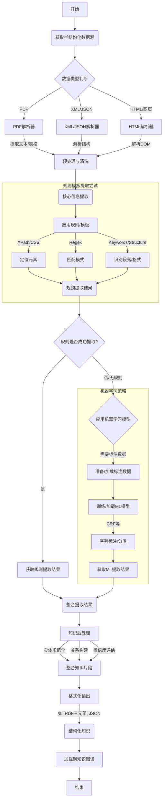
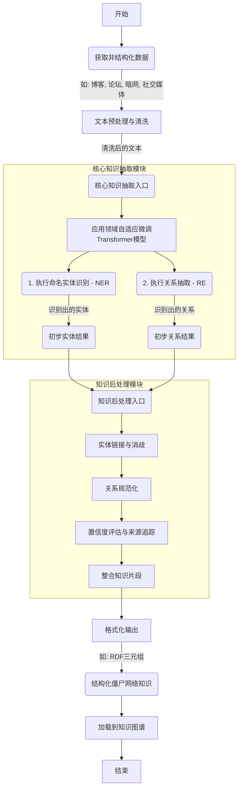
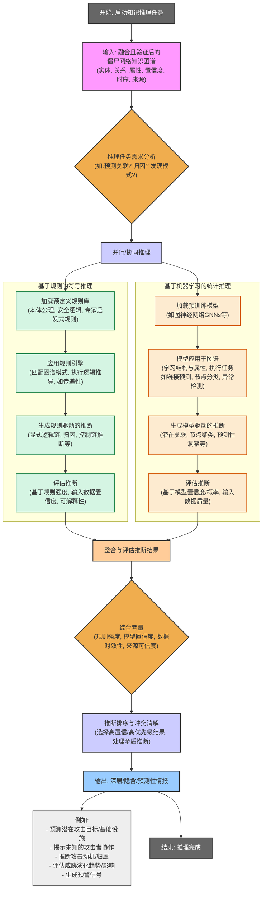

待处理图片1

```mermaid
graph TD
    A[开始] --> B(获取半结构化数据源);
    B --> C{数据类型判断};
    C -- PDF --> D[PDF解析器];
    C -- XML/JSON --> E[XML/JSON解析器];
    C -- HTML/网页 --> F[HTML解析器];

    D -- 提取文本/表格 --> G[预处理与清洗];
    E -- 解析结构 --> G;
    F -- 解析DOM --> G;

    G --> H(核心信息提取);

    subgraph 规则模板提取尝试
        direction TB
        H --> I[应用规则/模板];
        I -- XPath/CSS --> J[定位元素];
        I -- Regex --> K[匹配模式];
        I -- Keywords/Structure --> L[识别段落/格式];
        J --> M(规则提取结果);
        K --> M;
        L --> M;
    end

    M --> N{规则是否成功提取?};

    N -- 是 --> O[获取规则提取结果];

    N -- 否/无规则 --> P{应用机器学习模型};
        subgraph 机器学习策略
            direction TB
            %% P is the entry point
            P -- 需要标注数据 --> Q[准备/加载标注数据];
            Q --> R[训练/加载ML模型];
            R -- CRF等 --> S[序列标注/分类];
            S --> T[获取ML提取结果];
        end

    O --> U(整合提取结果);
    T --> U;

    U --> V[知识后处理];
    V -- 实体规范化 --> W;
    V -- 关系构建 --> W;
    V -- 置信度评估 --> W[整合知识片段];

    W --> X[格式化输出];
    X -- 如: RDF三元组, JSON --> Y(结构化知识);
    Y --> Z[加载到知识图谱];
    Z --> ZZ[结束];
```

待处理图片2

```mermaid
graph TD
    UA[开始] --> UB(获取非结构化数据);
    UB -- 如: 博客, 论坛, 暗网, 社交媒体 --> UC[文本预处理与清洗];

    %% 定义核心抽取子图及其内部结构
    subgraph 核心知识抽取模块
        direction TB
        %% 定义子图的入口节点
        UD(核心知识抽取入口) --> UE[应用领域自适应微调Transformer模型];
        UE --> UF(1. 执行命名实体识别 - NER);
        UF -- 识别出的实体 --> UH(初步实体结果);
        UE --> UG(2. 执行关系抽取 - RE);
        UG -- 识别出的关系 --> UI(初步关系结果);
    end

    %% 从预处理步骤链接到核心抽取子图的入口节点
    UC -- 清洗后的文本 --> UD;

    %% 定义后处理子图及其内部结构
    subgraph 知识后处理模块
        direction TB
        %% 定义子图的入口节点
        UJ(知识后处理入口) --> UK[实体链接与消歧];
        UK --> UL[关系规范化];
        UL --> UM[置信度评估与来源追踪];
        UM --> UN[整合知识片段];
    end

    %% 将核心抽取的结果链接到后处理子图的入口节点
    UH --> UJ;
    UI --> UJ;

    %% 后续流程
    UN --> UO[格式化输出];
    UO -- 如: RDF三元组 --> UP(结构化僵尸网络知识);
    UP --> UQ[加载到知识图谱];
    UQ --> UR[结束];
```

待处理图片3

```mermaid
graph TD
    %% --- 1. 定义样式 ---
    classDef inputStyle fill:#f9f,stroke:#333,stroke-width:2px;
    classDef processStyle fill:#ccf,stroke:#333,stroke-width:2px;
    classDef parallelStyle fill:#e6e6fa,stroke:#555,stroke-width:1px,stroke-dasharray: 5 5;
    classDef mergeStyle fill:#ffcc99,stroke:#333,stroke-width:2px;
    classDef outputStyle fill:#9cf,stroke:#333,stroke-width:2px;
    classDef ruleStyle fill:#d5f5e3,stroke:#1e8449,stroke-width:1.5px;
    classDef mlStyle fill:#fdebd0,stroke:#d35400,stroke-width:1.5px;
    classDef terminatorStyle fill:#666,stroke:#333,stroke-width:2px,color:#fff;
    classDef decisionStyle fill:#f0ad4e,stroke:#333,stroke-width:2px;
    classDef rectangleStyle fill:#eee,stroke:#333,stroke-width:1px;

    %% --- 2. 流程图节点定义 ---
    A["开始: 启动知识推理任务"]
    B["输入: 融合且验证后的<br>僵尸网络知识图谱<br>(实体, 关系, 属性, 置信度, 时序, 来源)"]
    C{"推理任务需求分析<br>(如:预测关联? 归因? 发现模式?)"}
    ParallelStart["并行/协同推理"]
    D["整合与评估推断结果"]
    D1{"综合考量<br>(规则强度, 模型置信度, 数据时效性, 来源可信度)"}
    D2["推断排序与冲突消解<br>(选择高置信/高优先级结果, 处理矛盾推断)"]
    E["输出: 深层/隐含/预测性情报"]
    E_Examples["例如:<br>- 预测潜在攻击目标/基础设施<br>- 揭示未知的攻击者协作<br>- 推断攻击动机/归属<br>- 评估威胁演化趋势/影响<br>- 生成预警信号"]
    E_End["结束: 推理完成"]

    %% --- 3. 子图定义 ---
    subgraph Rule-Based Reasoning [基于规则的符号推理]
        direction LR
        R1["加载预定义规则库<br>(本体公理, 安全逻辑, 专家启发式规则)"]
        R2["应用规则引擎<br>(匹配图谱模式, 执行逻辑推导, 如传递性)"]
        R3["生成规则驱动的推断<br>(显式逻辑链, 归因, 控制链推断等)"]
        R4["评估推断<br>(基于规则强度, 输入数据置信度, 可解释性)"]
    end

    subgraph ML-Based Reasoning [基于机器学习的统计推理]
        direction LR
        M1["加载预训练模型<br>(如图神经网络GNNs等)"]
        M2["模型应用于图谱<br>(学习结构与属性, 执行任务<br>如链接预测, 节点分类, 异常检测)"]
        M3["生成模型驱动的推断<br>(潜在关联, 节点聚类, 预测性洞察等)"]
        M4["评估推断<br>(基于模型置信度/概率, 输入数据质量)"]
    end

    %% --- 4. 链接定义 ---
    A --> B
    B --> C
    C --> ParallelStart
    ParallelStart --> R1
    ParallelStart --> M1
    R1 --> R2
    R2 --> R3
    R3 --> R4
    M1 --> M2
    M2 --> M3
    M3 --> M4
    R4 --> D
    M4 --> D
    D --> D1
    D1 --> D2
    D2 --> E
    E --> E_Examples
    E --> E_End

    %% --- 5. 样式应用 (放在最后) ---
    class A,E_End terminatorStyle;
    class B inputStyle;
    class C decisionStyle;
    class ParallelStart processStyle;
    class R1,R2,R3,R4 ruleStyle;
    class M1,M2,M3,M4 mlStyle;
    class D mergeStyle;
    class D1 decisionStyle;
    class D2 processStyle;
    class E outputStyle;
    class E_Examples rectangleStyle;
```
