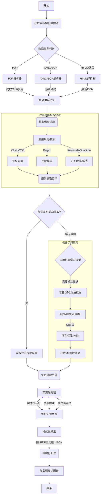

待处理图片1

```mermaid
graph TD
    A[开始] --> B(获取半结构化数据源);
    B --> C{数据类型判断};
    C -- PDF --> D[PDF解析器];
    C -- XML/JSON --> E[XML/JSON解析器];
    C -- HTML/网页 --> F[HTML解析器];

    D -- 提取文本/表格 --> G[预处理与清洗];
    E -- 解析结构 --> G;
    F -- 解析DOM --> G;

    G --> H(核心信息提取);

    subgraph 规则模板提取尝试
        direction TB
        H --> I[应用规则/模板];
        I -- XPath/CSS --> J[定位元素];
        I -- Regex --> K[匹配模式];
        I -- Keywords/Structure --> L[识别段落/格式];
        J --> M(规则提取结果);
        K --> M;
        L --> M;
    end

    M --> N{规则是否成功提取?};

    N -- 是 --> O[获取规则提取结果];

    N -- 否/无规则 --> P{应用机器学习模型};
        subgraph 机器学习策略
            direction TB
            %% P is the entry point
            P -- 需要标注数据 --> Q[准备/加载标注数据];
            Q --> R[训练/加载ML模型];
            R -- CRF等 --> S[序列标注/分类];
            S --> T[获取ML提取结果];
        end

    O --> U(整合提取结果);
    T --> U;

    U --> V[知识后处理];
    V -- 实体规范化 --> W;
    V -- 关系构建 --> W;
    V -- 置信度评估 --> W[整合知识片段];

    W --> X[格式化输出];
    X -- 如: RDF三元组, JSON --> Y(结构化知识);
    Y --> Z[加载到知识图谱];
    Z --> ZZ[结束];
```
