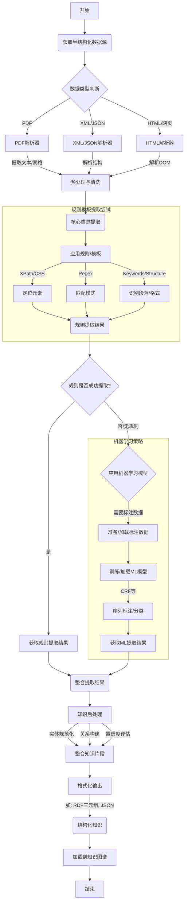
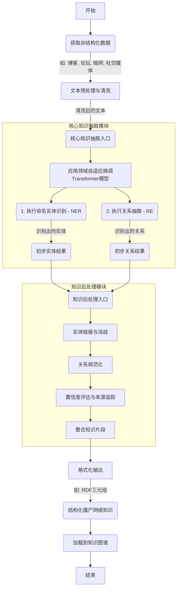

待处理图片1

```mermaid
graph TD
    A[开始] --> B(获取半结构化数据源);
    B --> C{数据类型判断};
    C -- PDF --> D[PDF解析器];
    C -- XML/JSON --> E[XML/JSON解析器];
    C -- HTML/网页 --> F[HTML解析器];

    D -- 提取文本/表格 --> G[预处理与清洗];
    E -- 解析结构 --> G;
    F -- 解析DOM --> G;

    G --> H(核心信息提取);

    subgraph 规则模板提取尝试
        direction TB
        H --> I[应用规则/模板];
        I -- XPath/CSS --> J[定位元素];
        I -- Regex --> K[匹配模式];
        I -- Keywords/Structure --> L[识别段落/格式];
        J --> M(规则提取结果);
        K --> M;
        L --> M;
    end

    M --> N{规则是否成功提取?};

    N -- 是 --> O[获取规则提取结果];

    N -- 否/无规则 --> P{应用机器学习模型};
        subgraph 机器学习策略
            direction TB
            %% P is the entry point
            P -- 需要标注数据 --> Q[准备/加载标注数据];
            Q --> R[训练/加载ML模型];
            R -- CRF等 --> S[序列标注/分类];
            S --> T[获取ML提取结果];
        end

    O --> U(整合提取结果);
    T --> U;

    U --> V[知识后处理];
    V -- 实体规范化 --> W;
    V -- 关系构建 --> W;
    V -- 置信度评估 --> W[整合知识片段];

    W --> X[格式化输出];
    X -- 如: RDF三元组, JSON --> Y(结构化知识);
    Y --> Z[加载到知识图谱];
    Z --> ZZ[结束];
```

待处理图片2

```mermaid
graph TD
    UA[开始] --> UB(获取非结构化数据);
    UB -- 如: 博客, 论坛, 暗网, 社交媒体 --> UC[文本预处理与清洗];

    %% 定义核心抽取子图及其内部结构
    subgraph 核心知识抽取模块
        direction TB
        %% 定义子图的入口节点
        UD(核心知识抽取入口) --> UE[应用领域自适应微调Transformer模型];
        UE --> UF(1. 执行命名实体识别 - NER);
        UF -- 识别出的实体 --> UH(初步实体结果);
        UE --> UG(2. 执行关系抽取 - RE);
        UG -- 识别出的关系 --> UI(初步关系结果);
    end

    %% 从预处理步骤链接到核心抽取子图的入口节点
    UC -- 清洗后的文本 --> UD;

    %% 定义后处理子图及其内部结构
    subgraph 知识后处理模块
        direction TB
        %% 定义子图的入口节点
        UJ(知识后处理入口) --> UK[实体链接与消歧];
        UK --> UL[关系规范化];
        UL --> UM[置信度评估与来源追踪];
        UM --> UN[整合知识片段];
    end

    %% 将核心抽取的结果链接到后处理子图的入口节点
    UH --> UJ;
    UI --> UJ;

    %% 后续流程
    UN --> UO[格式化输出];
    UO -- 如: RDF三元组 --> UP(结构化僵尸网络知识);
    UP --> UQ[加载到知识图谱];
    UQ --> UR[结束];
```
